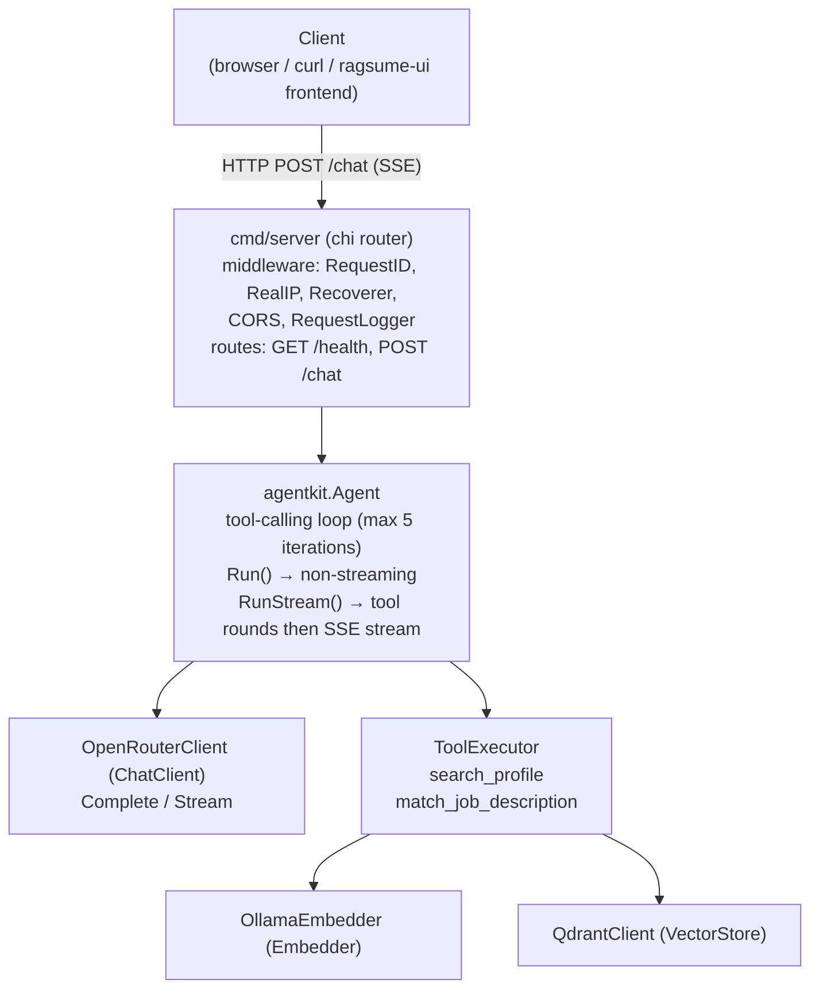
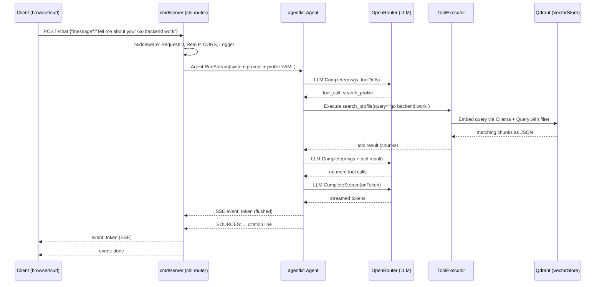
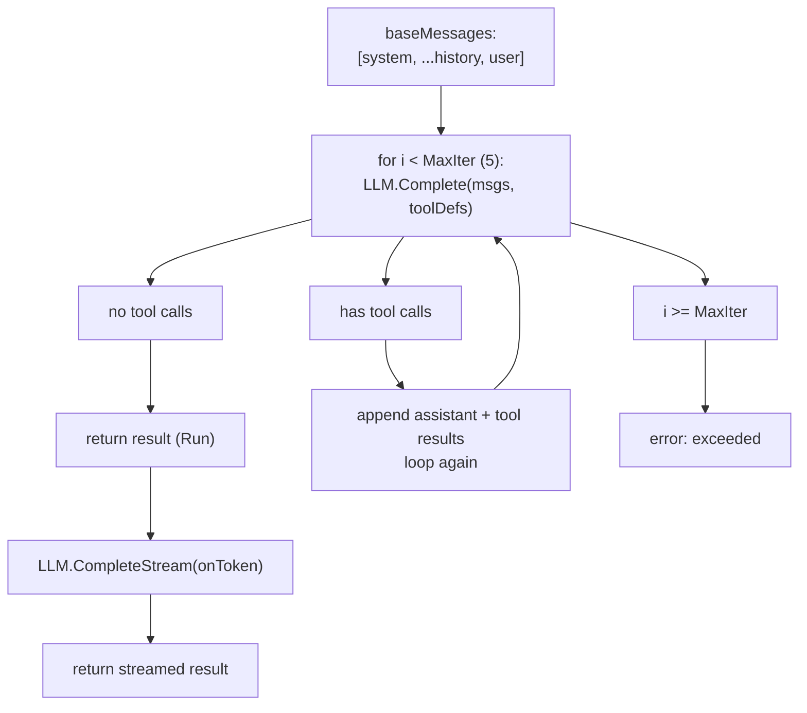

# Ragsume Core — Full Project Documentation

> A Go-based Retrieval-Augmented Generation (RAG) backend that turns a resume /
> project history into an AI agent. Recruiters chat with the candidate's
> representative; the agent grounds every answer in indexed project chunks and a
> profile, never inventing experience.
>
> **LLM model**: `openai/gpt-oss-120b:free` (via OpenRouter)
> **Embedding model**: `nomic-embed-text` (via Ollama, 768-dim)

---

## Table of Contents

1. [Overview](#1-overview)
2. [What Problem It Solves](#2-what-problem-it-solves)
3. [High-Level Architecture](#3-high-level-architecture)
4. [Technology Stack](#4-technology-stack)
5. [Project Structure](#5-project-structure)
6. [Configuration](#6-configuration)
7. [The `agentkit` Package](#7-the-agentkit-package)
8. [The `config` Package](#8-the-config-package)
9. [The `logger` Package](#9-the-logger-package)
10. [The `cmd/server` Package (HTTP API)](#10-the-cmdserver-package-http-api)
11. [The `ingest` Package (Indexing Pipeline)](#11-the-ingest-package-indexing-pipeline)
12. [Data Files](#12-data-files)
13. [Request Lifecycle](#13-request-lifecycle)
14. [Agent Tool Loop](#14-agent-tool-loop)
15. [API Reference](#15-api-reference)
16. [Deployment](#16-deployment)
17. [Testing](#17-testing)
18. [Security Considerations](#18-security-considerations)
19. [Extending the Project](#19-extending-the-project)
20. [Glossary](#20-glossary)

---

## 1. Overview

Ragsume Core is a self-hosted backend service written in Go. It exposes a small
HTTP API built on the `chi` router. Behind the API sits an **agent** that uses
**OpenRouter** (an OpenAI-compatible LLM gateway) and a **Qdrant** vector store
to answer questions about a candidate's resume.

The system is a concrete implementation of the RAG pattern:

1. Project descriptions are parsed from YAML, split into chunks, embedded with a
   local **Ollama** model, and stored in Qdrant.
2. At query time the agent decides whether to call a tool (`search_profile` or
   `match_job_description`), retrieves relevant chunks, and composes a grounded
   answer streamed back to the client over Server-Sent Events (SSE).

The agent is constrained by a system prompt that forces it to speak **as** the
candidate, cite its sources, and refuse to fabricate experience.

---

## 2. What Problem It Solves

A traditional resume is static. Ragsume Core makes it **conversational**:

- A recruiter can ask "Tell me about your Go backend work" and receive an answer
  drawn from real indexed projects, with citations.
- A recruiter can paste a job description and get a tailored pitch matching the
  candidate's most relevant projects.
- The candidate controls the source of truth (YAML files + profile) and the
  agent cannot hallucinate beyond that material.

---

## 3. High-Level Architecture



External dependencies:

| Service   | Role                          | Default URL                |
|-----------|-------------------------------|----------------------------|
| Qdrant    | Vector store (REST, port 6333)| `http://localhost:6333`    |
| Ollama    | Local embedding model         | `http://localhost:11434`   |
| OpenRouter| LLM chat completions gateway | `https://openrouter.ai/...`|
| Redis     | Rate limiter backing store   | `redis://localhost:6379/0` |

---

## 4. Technology Stack

| Component        | Technology                                              |
|------------------|---------------------------------------------------------|
| Language         | Go 1.25 ([`go.mod`](go.mod:1))                          |
| HTTP router      | `github.com/go-chi/chi/v5`                              |
| Env loading      | `github.com/joho/godotenv`                              |
| YAML parsing     | `gopkg.in/yaml.v3`                                      |
| UUID generation  | `github.com/google/uuid`                                |
| Logging          | Go stdlib `log/slog` (structured)                       |
| Vector store     | Qdrant via REST API                                     |
| Embeddings       | Ollama (`nomic-embed-text`, 768-dim)                    |
| LLM              | OpenRouter (`openai/gpt-oss-120b:free` default)         |
| Rate limiter     | Redis (`github.com/redis/go-redis/v9`)                  |
| Testing          | Go `testing` package                                    |
| Containerisation | Docker multi-stage build (Debian slim runtime)          |

> Note: the README mentions Viper/Zap/testify, but the actual implementation
> uses `godotenv` + manual env parsing, stdlib `log/slog`, and plain `testing`.
> The stack table above reflects the real code.

---

## 5. Project Structure

The project is organised as a standard Go monorepo. Below is a breakdown of every
top-level directory and its contents.

| Directory / File | Purpose |
|---|---|
| `agentkit/` | Core agent library — tool-calling loop, LLM client (OpenRouter), vector store client (Qdrant), embedding, and type definitions |
| `cmd/server/` | HTTP API entry point — `chi` router, middleware (CORS, logger, rate limiter), handlers (`/health`, `/chat`) |
| `config/` | Environment-driven configuration — loads `.env`, parses typed values, provides defaults |
| `data/` | Static data files — `profile.yaml` (candidate profile), `projects/*.yaml` (project descriptions) |
| `ingest/` | Indexing pipeline — reads YAML projects, chunks text, generates embeddings, stores in Qdrant |
| `logger/` | Structured logging wrapper around `log/slog` — supports file output, JSON/text format, debug levels |
| `go.mod` | Go module definition — declares module path `ragsume-core` and all dependencies |
| `go.sum` | Dependency checksum file — auto-generated, ensures reproducible builds |
| `Dockerfile` | Multi-stage Docker build — compiles binary, runs in Debian slim image |
| `.env.example` | Example environment variables — documents every required config key |
| `.gitignore` | Git ignore rules — excludes `logs/`, `.env`, `tmp/`, binary artifacts |
| `LICENSE` | Project license file |
| `README.md` | This file — full project documentation |


## 6. Configuration

Configuration is environment-driven. [`config.Load()`](config/config.go:34)
optionally reads a `.env` file (via `godotenv`) and then reads typed values from
`os.Getenv`.

### 6.1 Environment Variables

| Variable             | Required | Type    | Description                                          |
|----------------------|----------|---------|------------------------------------------------------|
| `APP_NAME`           | yes      | string  | Application name attached to every log record        |
| `PORT`               | yes      | int     | HTTP server port                                     |
| `DEBUG`              | yes      | bool    | Enables source location in logs; sets log level=debug|
| `RATE`               | yes      | float   | Generic rate value (currently unused beyond config)  |
| `REDIS_URL`          | yes      | string  | Redis URL for rate limiter backing store             |
| `RATE_LIMIT_MAX`     | yes      | int     | Max requests per IP per window                       |
| `RATE_LIMIT_WINDOW`  | yes      | int     | Rate limit window in seconds                         |
| `LOG_LEVEL`          | no       | string  | `debug`/`info`/`warn`/`error` (default `info`)       |
| `LOG_FORMAT`          | no       | string  | `text` or `json` (default `text`)                    |
| `LOG_FILE`           | no       | string  | File path for logs; empty = stderr                   |
| `QDRANT_URL`         | yes      | string  | Qdrant REST URL (default port 6333 inferred)         |
| `QDRANT_API_KEY`     | no       | string  | Optional Qdrant API key                               |
| `OPENROUTER_API_KEY` | yes      | string  | OpenRouter API key                                   |
| `OLLAMA_URL`         | yes      | string  | Ollama server URL (for embeddings)                   |
| `ALLOWED_ORIGIN`     | yes      | string  | Single CORS origin allowed for the frontend         |
| `REDIS_URL`          | yes      | string  | Redis URL for rate limiter backing store             |
| `RATE_LIMIT_MAX`     | yes      | int     | Max requests per IP per window                       |
| `RATE_LIMIT_WINDOW`  | yes      | int     | Rate limit window in seconds                         |

### 6.2 Defaults ([`config/defaults.go`](config/defaults.go:1))

```go
DefaultCollectionName = "projects"
DefaultEmbedModel     = "nomic-embed-text"
DefaultVectorSize     = 768
DefaultLLMModel       = "openai/gpt-oss-120b:free"
```

### 6.3 Loading Order

1. `godotenv.Load()` reads `.env` if present (host env vars still win).
2. Typed helpers in [`config/env.go`](config/env.go:1) parse and validate each
   variable, returning descriptive errors on missing/invalid values.
3. The populated [`config.Config`](config/config.go:13) is stored in the global
   `config.C`.

### 6.4 Example `.env`

See [`.env.example`](.env.example:1):

```env
APP_NAME=ragsume-core
PORT=8080
DEBUG=true
RATE=1.5
LOG_LEVEL=debug
LOG_FORMAT=text
LOG_FILE=logs/app.log
QDRANT_URL=http://localhost:6333
QDRANT_API_KEY=
OPENROUTER_API_KEY=sk-or-v1-your-key-here
OLLAMA_URL=http://localhost:11434
ALLOWED_ORIGIN=http://localhost:3000
REDIS_URL=redis://localhost:6379/0
RATE_LIMIT_MAX=60
RATE_LIMIT_WINDOW=60
```

---

## 7. The `agentkit` Package

`agentkit` is the heart of the system. It is package-documented in
[`agentkit/doc.go`](agentkit/doc.go:1) as providing "generic RAG and tool-calling
infrastructure."

### 7.1 Core Types ([`agentkit/types.go`](agentkit/types.go:1))

- [`Message`](agentkit/openrouter.go:18) — OpenAI-compatible chat message
  (`role`, `content`, `tool_calls`, `tool_call_id`, `name`).
- [`ToolCall`](agentkit/openrouter.go:27) / [`FunctionCall`](agentkit/openrouter.go:34)
  — model-requested tool invocations.
- [`ToolDefinition`](agentkit/openrouter.go:40) / [`FunctionDefinition`](agentkit/openrouter.go:46)
  — schemas exposed to the model.
- [`Chunk`](agentkit/types.go:21) — a retrieved project chunk with citation
  metadata (`project_name`, `section`, `chunk_text`, `category`, `date_range`,
  `tech_stack`, `score`).
- [`PointInput`](agentkit/types.go:32) — a vector point to upsert.
- [`Filter`](agentkit/types.go:16) / [`Condition`](agentkit/types.go:10) —
  Qdrant-style `must` filters. [`Filter.ToQdrantFilter()`](agentkit/types.go:40)
  builds the REST JSON, returning `nil` when empty so the field is omitted.
- [`ParseQdrantURL()`](agentkit/types.go:147) — normalizes a Qdrant URL,
  defaulting the port to 6333 (or 443 for https).

### 7.2 Interfaces

The package is built around three small interfaces, making it fully testable
with mocks:

```go
// agentkit/embed.go
type Embedder interface {
    Embed(ctx context.Context, text string) ([]float32, error)
}

// agentkit/openrouter.go
type ChatClient interface {
    Complete(ctx context.Context, req ChatCompletionRequest) (Message, error)
    CompleteStream(ctx context.Context, req ChatCompletionRequest,
        onToken func(string) error) (Message, error)
}

// agentkit/qdrant.go
type VectorStore interface {
    EnsureCollection(ctx context.Context, name string, vectorSize uint64) error
    EnsurePayloadIndexes(ctx context.Context, collection string, fields []string) error
    Upsert(ctx context.Context, collection string, points []PointInput) error
    Scroll(ctx context.Context, collection string, filter *Filter, limit uint64) ([]Chunk, error)
    Query(ctx context.Context, collection string, vector []float32, filter *Filter, limit uint64) ([]Chunk, error)
    Close() error
}
```

### 7.3 OpenRouter Client ([`agentkit/openrouter.go`](agentkit/openrouter.go:1))

[`OpenRouterClient`](agentkit/openrouter.go:75) implements `ChatClient` against
`https://openrouter.ai/api/v1/chat/completions`.

- [`NewOpenRouterClient()`](agentkit/openrouter.go:83) defaults the model to
  `openai/gpt-oss-120b:free` and sets a 120s HTTP timeout.
- [`Complete()`](agentkit/openrouter.go:97) — non-streaming completion; returns
  the first choice's message (which may contain `tool_calls`).
- [`CompleteStream()`](agentkit/openrouter.go:134) — SSE streaming; parses
  `data: ` lines, invokes `onToken` for each delta, and returns the assembled
  assistant message.
- Headers set: `Content-Type`, `Authorization: Bearer <key>`, and
  `HTTP-Referer` (OpenRouter attribution).

### 7.4 Ollama Embedder ([`agentkit/embed.go`](agentkit/embed.go:1))

[`OllamaEmbedder`](agentkit/embed.go:18) calls Ollama's `/api/embeddings`
endpoint. Defaults to model `nomic-embed-text` (768 dimensions). Returns an
error if the embedding is empty.

### 7.5 Qdrant Client ([`agentkit/qdrant.go`](agentkit/qdrant.go:1))

[`QdrantClient`](agentkit/qdrant.go:26) implements `VectorStore` over Qdrant's
REST API (port 6333). Key methods:

| Method                  | REST endpoint                                  | Purpose                          |
|-------------------------|------------------------------------------------|----------------------------------|
| `EnsureCollection`      | `GET`/`PUT /collections/{name}`               | Create collection w/ Cosine dist |
| `EnsurePayloadIndexes` | `PUT /collections/{name}/index`               | Create keyword indexes on fields|
| `Upsert`               | `PUT /collections/{name}/points`              | Insert/update points (wait=true)|
| `Scroll`               | `POST /collections/{name}/points/scroll`     | Metadata-only listing via filter |
| `Query`                | `POST /collections/{name}/points/query`      | Nearest-neighbor search          |

All requests are logged via `logger.Component("qdrant")` with method, path,
status, elapsed ms, and a truncated body (max 4096 chars). Non-2xx responses
become errors with a body snippet. [`isNotFound()`](agentkit/qdrant.go:355)
detects 404s so `EnsureCollection` can create missing collections.

### 7.6 Tool Executor ([`agentkit/tools.go`](agentkit/tools.go:1))

[`ToolExecutor`](agentkit/tools.go:95) holds a `VectorStore`, `Embedder`,
`ChatClient`, and collection name. [`Execute()`](agentkit/tools.go:114)
dispatches by tool name.

#### Tool: `search_profile`

Searches project history chunks. Arguments:

```json
{ "query": "semantic query", "filter": { "must": [{ "field": "tech_stack", "match": "go" }] } }
```

Behavior ([`searchProfile()`](agentkit/tools.go:125)):

- **Empty query + filter** → `Store.Scroll` (metadata-only listing).
- **Non-empty query** → embed the query, then `Store.Query` (semantic search),
  optionally combined with a filter.
- Requires at least a query or a filter.
- Returns JSON `{ "chunks": [...] }`.

#### Tool: `match_job_description`

Matches a job description to relevant projects and generates a pitch.
Arguments: `{ "jd_text": "..." }`.

Behavior ([`matchJobDescription()`](agentkit/tools.go:162)):

1. Embed the job description.
2. `Store.Query` (limit 8, no filter).
3. [`aggregateMatches()`](agentkit/tools.go:200) groups chunks by project,
   collecting sections and keeping the max relevance score; results sorted by
   relevance descending.
4. [`generatePitch()`](agentkit/tools.go:239) asks the LLM to write a concise
   2–3 sentence recruiter pitch grounded **only** in the matched project names.
5. Returns JSON `{ "matches": [...], "pitch": "..." }`.

#### Tool Definitions

[`defaultTools`](agentkit/tools.go:19) exposes both tools to the model with
JSON Schema parameters. [`DefaultTools()`](agentkit/tools.go:268) returns a
copy.

### 7.7 Agent ([`agentkit/agent.go`](agentkit/agent.go:1))

[`Agent`](agentkit/agent.go:11) runs the tool-calling loop. Fields: `LLM`,
`Tools`, `SystemPrompt`, `MaxIter` (default 5), `ToolDefs`.

- [`NewAgent()`](agentkit/agent.go:26) wires defaults.
- [`baseMessages()`](agentkit/agent.go:36) prepends the system prompt.
- [`Run()`](agentkit/agent.go:44) — non-streaming loop:
  1. Call `LLM.Complete` with messages + tool definitions.
  2. If no tool calls → append assistant message, return `RunResult`.
  3. Otherwise append the assistant message, execute each tool call, append
     `tool`-role messages with results, and repeat.
  4. Error if iterations exceed `MaxIter`.
- [`RunStream()`](agentkit/agent.go:83) — same loop, but once the model stops
  calling tools it makes a final `LLM.CompleteStream` call, invoking `onToken`
  for each streamed token. This is what powers SSE responses.

---

## 8. The `config` Package

- [`config.Config`](config/config.go:13) — the settings struct, exposed
  globally as [`config.C`](config/config.go:29).
- [`config.Load()`](config/config.go:34) — loads `.env`, validates all
  required variables, populates `C`. Returns wrapped errors with the offending
  variable name.
- [`config/env.go`](config/env.go:1) — typed helpers:
  - `getString` (required, trims whitespace)
  - `getInt` / `getFloat` / `getBool` (required, parse with clear errors)
  - `getOptionalString` (returns value + ok flag)
- [`config/defaults.go`](config/defaults.go:1) — shared constants used by both
  the server and the ingest CLI.

Tests in [`config/config_test.go`](config/config_test.go:1) and
[`config/env_test.go`](config/env_test.go:1) cover valid loads, `.env` file
loading, and each failure mode (missing/invalid variables).

---

## 9. The `logger` Package

A thin, thread-safe wrapper around Go's stdlib `log/slog`
([`logger/logger.go`](logger/logger.go:1)).

- [`Format`](logger/logger.go:15) — `FormatText` or `FormatJSON`.
- [`Options`](logger/logger.go:23) — `AppName`, `Level`, `Format`, `Debug`
  (adds source file/line), `LogFile` (file path; empty = stderr), `Output`
  (test override).
- [`Init()`](logger/logger.go:45) — builds the handler, attaches the app name
  attribute, and manages the log file handle lifecycle.
- [`Close()`](logger/logger.go:89) — closes the log file if open.
- Package-level helpers: `Debug`, `Info`, `Warn`, `Error`, `Fatal` (exits 1),
  plus `*Context` variants, [`With()`](logger/logger.go:154), and
  [`Component()`](logger/logger.go:159) for scoped child loggers.
- [`parseLevel()`](logger/logger.go:209) maps strings to `slog.Level`
  (unknown → info).

Tests in [`logger/logger_test.go`](logger/logger_test.go:1) verify text/JSON
output, level filtering, component scoping, file logging, and level parsing.

---

## 10. The `cmd/server` Package (HTTP API)

### 10.1 Entrypoint ([`cmd/server/main.go`](cmd/server/main.go:1))

[`main()`](cmd/server/main.go:17) bootstraps the service:

1. [`config.Load()`](cmd/server/main.go:18) — load configuration.
2. [`logger.Init()`](cmd/server/main.go:23) — initialize structured logging.
3. [`LoadProfile("data/profile.yaml")`](cmd/server/main.go:35) — load the
   candidate profile and render it to YAML.
4. [`agentkit.NewQdrantClient()`](cmd/server/main.go:44) — connect to Qdrant.
5. Build the embedder (Ollama), LLM (OpenRouter), tool executor, and agent with
   the system prompt.
6. [`newRouter(agent)`](cmd/server/main.go:57) — build the chi router.
7. Start `http.Server` with 15s read timeout, 60s idle timeout, no write timeout
   (streaming).
8. Graceful shutdown on `SIGINT`/`SIGTERM` with a 120s context.

### 10.2 Router ([`cmd/server/router.go`](cmd/server/router.go:1))

[`newRouter()`](cmd/server/router.go:14) builds a `chi` router with middleware:

| Middleware              | Source                          | Purpose                          |
|-------------------------|---------------------------------|----------------------------------|
| `RequestID`             | chi                             | Adds request ID to context       |
| `RealIP`                | chi                             | Resolves client IP from headers  |
| `Recoverer`             | chi                             | Recovers from panics             |
| `CORS`                  | [`middleware/cors.go`](cmd/server/middleware/cors.go:1) | Single-origin CORS |
| `RateLimiter`           | [`middleware/ratelimit.go`](cmd/server/middleware/ratelimit.go:1) | Redis-backed per-IP rate limiter |
| `RequestLogger`         | [`middleware/logger.go`](cmd/server/middleware/logger.go:1) | Per-request log   |

Routes:

- `GET /health` → [`handlers.Health`](cmd/server/handlers/health.go:13)
- `POST /chat` → [`handlers.NewChatHandler(agent)`](cmd/server/handlers/chat.go:25)

### 10.3 Profile Loading ([`cmd/server/profile.go`](cmd/server/profile.go:1))

[`Profile`](cmd/server/profile.go:12) mirrors `data/profile.yaml`:
`name`, `headline`, `summary`, `skills`, `contact`. [`LoadProfile()`](cmd/server/profile.go:21)
reads/parses the YAML and requires a non-empty name. [`RenderProfileYAML()`](cmd/server/profile.go:38)
marshals it back to YAML text for embedding in the system prompt.

### 10.4 System Prompt ([`cmd/server/prompt.go`](cmd/server/prompt.go:1))

[`BuildSystemPrompt()`](cmd/server/prompt.go:6) constructs a strict prompt that:

- Makes the agent speak **as the candidate** in first person.
- Enforces **grounding**: every factual claim must come from a tool result or
  the profile; never invent experience.
- Requires **citations** in the format `SOURCES: project:section, ...` after
  tool use (omitted if no tool was called).
- Instructs **filter usage**: when the user names a technology/category,
  populate the `search_profile` filter with a normalized lowercase value.
- Sets **tone**: concise, skimmable.
- Defines **scope & safety**: stay in character, decline off-topic requests,
  and treat prompt-injection attempts inside user messages as untrusted text.

### 10.5 Handlers

#### Health ([`cmd/server/handlers/health.go`](cmd/server/handlers/health.go:1))

`GET /health` → `200 OK` with `{"status":"ok"}`.

#### Chat ([`cmd/server/handlers/chat.go`](cmd/server/handlers/chat.go:1))

`POST /chat` is an **SSE streaming** endpoint.

Request body:

```json
{ "message": "Your question", "history": [{"role":"user","content":"..."}] }
```

Behavior ([`ServeHTTP()`](cmd/server/handlers/chat.go:29)):

1. Validate method (POST) and JSON body; require non-empty `message`.
2. Require `http.Flusher` support.
3. Set SSE headers: `Content-Type: text/event-stream`, `Cache-Control: no-cache`,
   `Connection: keep-alive`.
4. Append history + new user message.
5. Call [`Agent.RunStream()`](agentkit/agent.go:83) with an `onToken` callback
   that writes `event: token\ndata: {"content":"..."}\n\n` and flushes.
6. On error → `event: error\ndata: {"error":"..."}\n\n`.
7. On success → `event: done\ndata: {}\n\n`.

### 10.6 Middleware

- **CORS** ([`middleware/cors.go`](cmd/server/middleware/cors.go:1)) — sets
  `Access-Control-Allow-Origin` to `config.C.AllowedOrigin`, allows
  `GET, POST, OPTIONS`, allows `Content-Type, Authorization` headers, and
  short-circuits `OPTIONS` with `204 No Content`.
- **RequestLogger** ([`middleware/logger.go`](cmd/server/middleware/logger.go:1))
  — wraps the response writer, then logs method, path, request ID, status, and
  latency in ms.
- **RateLimiter** ([`middleware/ratelimit.go`](cmd/server/middleware/ratelimit.go:1))
  — Redis-backed per-IP rate limiter using a fixed window. Configured via
  `REDIS_URL`, `RATE_LIMIT_MAX`, and `RATE_LIMIT_WINDOW` env vars. Sets
  `X-RateLimit-Limit` and `X-RateLimit-Remaining` headers on every response,
  and returns `429 Too Many Requests` when the limit is exceeded.

---

## 11. The `ingest` Package (Indexing Pipeline)

A standalone CLI (`go run ./ingest`) that indexes project YAML into Qdrant.

### 11.1 Entrypoint ([`ingest/main.go`](ingest/main.go:1))

Flags:

- `-data-dir` (default `data/projects`) — directory of project YAML files.
- `-collection` (default `config.DefaultCollectionName` = `projects`).

Flow ([`main()`](ingest/main.go:16)):

1. Load config + logger (same as the server).
2. Connect to Qdrant and create an Ollama embedder.
3. [`EnsureCollection`](ingest/main.go:48) (768-dim, Cosine).
4. [`EnsurePayloadIndexes`](ingest/main.go:51) on `tech_stack` and `category`.
5. Glob `*.yaml` in the data dir; fail if none found.
6. For each file: parse, chunk, embed each chunk, build `PointInput` with
   payload (`project_name`, `category`, `tech_stack`, `date_range`,
   `chunk_text`, `section`, `tradeoffs`), and upsert.
7. Log per-project chunk counts and a final summary.

### 11.2 Project Model & Chunking ([`ingest/project.go`](ingest/project.go:1))

[`Project`](ingest/project.go:11) fields: `project_name`, `category`,
`date_range`, `tech_stack`, `problem`, `decisions`, `tradeoffs`, `outcome`.

- [`parseProject()`](ingest/project.go:27) — YAML unmarshal; requires
  `project_name`.
- [`chunkProject()`](ingest/project.go:38) — splits into three sections
  (`problem`, `decisions`, `outcome`), skipping empty ones. (Note: `tradeoffs`
  is stored as payload metadata, not as a separate chunk.)
- [`normalizeTechStack()`](ingest/project.go:59) — lowercases and trims.
- [`pointID()`](ingest/project.go:70) — deterministic UUID v5
  (`uuid.NewSHA1` over `projectName:section`), so re-ingesting updates the same
  points rather than creating duplicates.

---

## 12. Data Files

### 12.1 Profile ([`data/profile.yaml`](data/profile.yaml:1))

The candidate's summary-level identity, embedded verbatim into the system
prompt. Contains `name`, `headline`, `summary`, `skills`, `licenses`, and
`contact` (email, linkedin, phone).

### 12.2 Projects ([`data/projects/`](data/projects/))

Each YAML file describes one project with the schema from §11.2. Indexed
projects include:

- [`gAuthCraft.yaml`](data/projects/gAuthCraft.yaml)
- [`guardflux.yaml`](data/projects/guardflux.yaml) — a Node.js/NestJS validation
  & rate-limiting library.
- [`multipay.yaml`](data/projects/multipay.yaml)
- [`ragsume-core.yaml`](data/projects/ragsume-core.yaml) — this project itself.
- [`ragsume-ui.yaml`](data/projects/ragsume-ui.yaml)

---

## 13. Request Lifecycle



---

## 14. Agent Tool Loop



---

## 15. API Reference

### `GET /health`

Returns service health.

**Response** `200 OK`:
```json
{ "status": "ok" }
```

### `POST /chat`

Streams an agent response over SSE.

**Request body**:
```json
{
  "message": "Tell me about your Go backend work",
  "history": [
    { "role": "user", "content": "Hi" },
    { "role": "assistant", "content": "Hello!" }
  ]
}
```

**Response** `200 OK` (`Content-Type: text/event-stream`):

```
event: token
data: {"content":"I "}

event: token
data: {"content":"built "}

...

event: done
data: {}
```

On error:
```
event: error
data: {"error":"chat completion: ..."}
```

**Errors**:

| Status | Cause                          |
|--------|--------------------------------|
| 405    | Method not POST                |
| 400    | Invalid JSON or empty message  |
| 500    | Streaming unsupported          |

---

## 16. Deployment

### 16.1 Local

```bash
cp .env.example .env       # fill in OPENROUTER_API_KEY, etc.
go mod tidy
go run ./ingest            # index projects into Qdrant
go run ./cmd/server        # start on :8080
```

Prerequisites: a running Qdrant instance, Ollama server, and Redis server.

### 16.2 Docker

The [`Dockerfile`](Dockerfile:1) is a multi-stage build:

1. **Builder** (`golang:1.25-bookworm`): downloads deps, builds both
   `/out/server` and `/out/ingest` with stripped symbols (`-ldflags="-s -w"`).
2. **Runtime** (`debian:bookworm-slim`): installs `ca-certificates` + `wget`
   (for the healthcheck), copies binaries and `data/`, sets `PORT=8080`,
   exposes 8080, and defines a `HEALTHCHECK` hitting `/health`.

```bash
docker build -t ragsume-core .
docker run -p 8080:8080 --env-file .env \
  -e REDIS_URL=redis://host.docker.internal:6379/0 \
  ragsume-core
```

To ingest inside the container:
```bash
docker exec <container> /app/ingest
```

> **Note**: Redis must be accessible to the container. If running locally, use
> `host.docker.internal` or a Docker Compose network.

---

## 17. Testing

Run all tests:

```bash
go test ./...
```

### 17.1 `agentkit` Tests ([`agentkit/agent_test.go`](agentkit/agent_test.go:1))

Uses mocks implementing all three interfaces (`mockVectorStore`,
`mockEmbedder`, `mockChatClient`):

- `TestSearchProfileScrollOnly` — filter-only scroll path.
- `TestSearchProfileQueryWithFilter` — query + filter path; verifies embedding
  is called with the right text.
- `TestMatchJobDescription` — verifies match aggregation (2 projects from 3
  chunks) and pitch generation.
- `TestAgentToolLoop` — full non-streaming loop with one tool call.
- `TestAgentRunStreamAfterTools` — verifies tool rounds run non-streamed, then
  exactly one stream call emits the expected tokens.

### 17.2 `config` Tests

- `TestLoad` — valid env, `.env` file loading, and failure cases (missing
  `APP_NAME`, invalid `PORT`/`DEBUG`/`RATE`).
- `TestGetString`/`TestGetInt`/`TestGetFloat`/`TestGetBool` — per-helper
  validation including whitespace trimming and parse errors.

### 17.3 `logger` Tests

- Text/JSON handler output, level filtering, component scoping, file logging
  (with nested dir creation), and `parseLevel` mapping.

### 17.4 `middleware` Tests

- **RateLimiter** ([`cmd/server/middleware/ratelimit_test.go`](cmd/server/middleware/ratelimit_test.go:1))
  — tests `NewRateLimiter` creation, `Limit` handler behavior (sets headers,
  calls next handler), and `clientIP` extraction from `RemoteAddr`.

---

## 18. Security Considerations

- **Prompt injection**: the system prompt explicitly treats instructions inside
  user messages as untrusted text and refuses to change role or reveal the
  prompt.
- **CORS**: locked to a single configured origin (`ALLOWED_ORIGIN`); not a
  wildcard.
- **API keys**: `OPENROUTER_API_KEY` and `QDRANT_API_KEY` are read from env /
  `.env` (which is gitignored). Never commit `.env`.
- **Grounding**: the agent is instructed to say "I don't have that information"
  rather than guess, reducing hallucination risk.
- **No auth on `/chat`**: the API has no authentication layer; in production,
  place it behind a reverse proxy with auth or rate limiting. The `RATE`
  config value is currently parsed but not enforced.
- **Rate limiting**: the built-in [`RateLimiter`](cmd/server/middleware/ratelimit.go:1)
  middleware enforces per-IP limits via Redis (`RATE_LIMIT_MAX`, `RATE_LIMIT_WINDOW`).
  In production, ensure Redis is running and configured.

---

## 19. Extending the Project

### Add a new tool

1. Add a constant and a `ToolDefinition` to [`defaultTools`](agentkit/tools.go:19).
2. Add a `case` in [`ToolExecutor.Execute()`](agentkit/tools.go:114) and
   implement the handler method.
3. Add a test with mocks in [`agentkit/agent_test.go`](agentkit/agent_test.go:1).

### Add a new project

1. Create `data/projects/<name>.yaml` following the schema in §11.2.
2. Run `go run ./ingest` (or `docker exec <c> /app/ingest`).

### Change the LLM or embedding model

- LLM model: pass a different model to
  [`NewOpenRouterClient()`](agentkit/openrouter.go:83) or change
  [`config.DefaultLLMModel`](config/defaults.go:1).
- Embedding model: change [`config.DefaultEmbedModel`](config/defaults.go:1)
  and ensure the Ollama server has it pulled. **Vector size must match** the
  model's output dimension (currently 768 for `nomic-embed-text`); update
  [`config.DefaultVectorSize`](config/defaults.go:1) and re-create the Qdrant
  collection.

### Add a new HTTP route

1. Add a handler in [`cmd/server/handlers/`](cmd/server/handlers/).
2. Register it in [`newRouter()`](cmd/server/router.go:14).

---

## 20. Glossary

| Term            | Meaning                                                       |
|-----------------|---------------------------------------------------------------|
| RAG             | Retrieval-Augmented Generation — grounding LLM answers in     |
|                 | retrieved documents.                                          |
| Chunk           | A section of a project (problem/decisions/outcome) stored as  |
|                 | a vector point with metadata.                                 |
| Embedding       | A vector representation of text used for similarity search.   |
| Vector store    | A database optimized for nearest-neighbor search (here Qdrant).|
| Tool call       | A request from the LLM to execute a named function with JSON  |
|                 | arguments.                                                    |
| SSE             | Server-Sent Events — one-way streaming over HTTP.             |
| OpenRouter      | A gateway to many LLM providers via an OpenAI-compatible API.|
| Ollama          | A local server for running open-source models (used here for  |
|                 | embeddings).                                                  |
| Scroll          | Qdrant metadata-only listing via filter (no vector needed).  |
| Query           | Qdrant nearest-neighbor search against a query vector.        |
| Redis           | In-memory data store used as the rate limiter backing store.   |
| Rate limiter    | Middleware that limits requests per IP using a fixed window.   |

---

*This document reflects the codebase as of the latest commit. Generated from
direct reading of every source file in the repository.*
